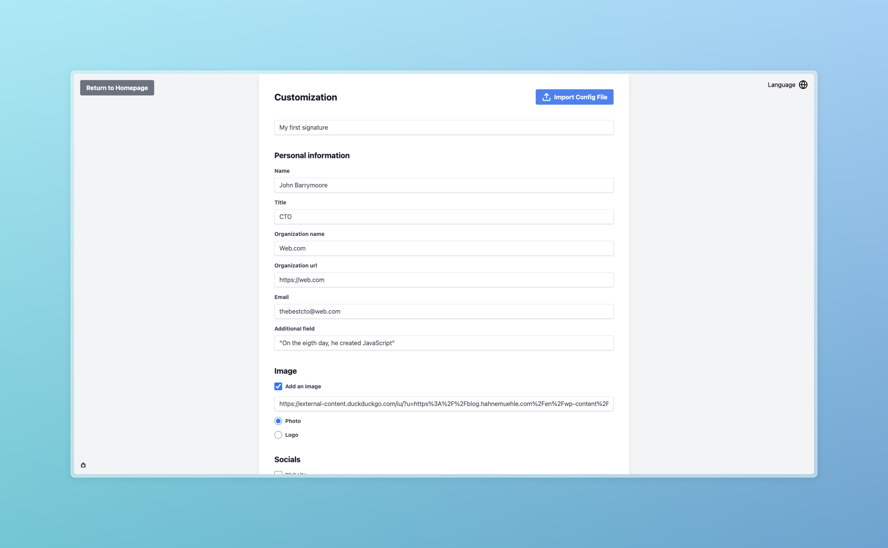
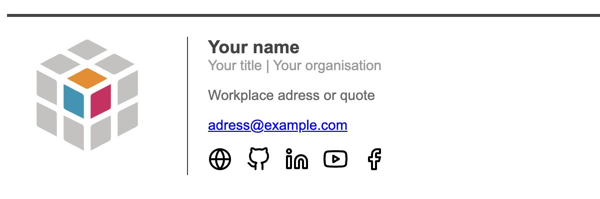
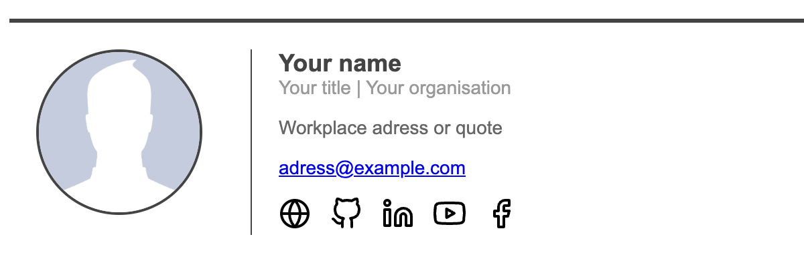

# Emails-Signature-Generator-Website

> A website to create and customize your email signature in seconds.

[](https://emails-signature-generator.vercel.app)

| [](https://emails-signature-generator.vercel.app) | [](https://emails-signature-generator.vercel.app) |
| :------------------------------------------------------------------------------------------------: | :--------------------------------------------------------------------------------------------------: |

```yaml
signature_name: demo
personal_information:
  name: Your name
  title: Your title
  organization_name: Your organisation
  organization_url: https://web.com
  email: adress@example.com
  additional: Workplace adress or quote
image:
  is_image_selected: false
  image_link: https://raw.githubusercontent.com/MorganKryze/Email-Signature-Generator/main/src/assets/default.jpg
  image_type: photo
socials:
  is_web_selected: true
  web_link: https://example.com
  is_github_selected: true
  github_link: https://example.com
  is_instagram_selected: false
  instagram_link: None
  is_linkedin_selected: true
  linkedin_link: https://example.com
  is_slack_selected: false
  slack_link: None
  is_youtube_selected: true
  youtube_link: https://example.com
  is_twitter_selected: false
  twitter_link: None
  is_facebook_selected: true
  facebook_link: https://example.com
```

Config file example (yaml format).

## Getting Started

The project does not need to be installed to be used as it is available [here](https://emails-signature-generator.vercel.app).

### Prerequisites

- Python 3.9 (not higher because of Django 4.2.9)

### Build

To build the project, you can either download the zip file or clone the repository:

```bash
git clone https://github.com/MorganKryze/Emails-Signature-Generator-Website.git
```

In addition, you will need to install the following libraries in your python environment:

```bash
cd Emails-Signature-Generator-Website
pip install -r requirements.txt
```

> [!NOTE]
> I recomment using a virtual environment ([venv](https://docs.python.org/3/library/venv.html) or [conda](https://docs.conda.io/projects/conda/en/latest/user-guide/tasks/manage-environments.html)) to avoid conflicts with your other projects.

You also need gettext to compile the translations. The details instructions are available [here](https://www.drupal.org/docs/8/modules/potion/how-to-install-setup-gettext).

### Usage

Now you may use the executable files from the dev_wrokflow folder to run the project:

This command will start the server on your local machine:

```bash
sh dev_workflow/run.sh
```

This command will create the ids for the messages of the app:

```bash
sh dev_workflow/create_trans_ids.sh
```

This command will compile the messages of the app:

```bash
sh dev_workflow/load_trans.sh
```

#### Troubleshooting

If you have an issue version collecting next to the bug button or launching the app, that means that you need to create your .env file (local) or to add the environment variables in your deployment environment (vercel or another). The .env file should look like this:

```plaintext
DJANGO_SECRET_KEY=your_django_secret_key
IS_IN_DEBUG_MODE=False
```

For the version part, just add your Github token to the environment variables:

```plaintext
GITHUB_TOKEN=your_github_token
```

### Project structure

Here are the most important files and directories of the project( you may ignore the other files and directories):

```plaintext
Emails-Signature-Generator-Website
├── dev_workflow
│   ├── create_trans_id.sh
│   ├── load_trans.sh
│   └── run.sh
├── generator
│   ├── locale
│   │   ├── de
│   │   ├── en
│   │   ├── es
│   │   └── fr
│   ├── templates
│   │   ├── base.html
│   │   ├── signature-template.html
│   │   └── 404.html
│   ├── forms.py
│   ├── tools.py
│   ├── urls.py
│   └── views.py
├── config
│   ├── settings.py
│   ├── urls.py
│   └── wsgi.py
├── assets
│   └── img
│       └── ...
├── .gitignore
├── LICENSE
├── README.md
├── requirements.txt
├── .env.example
├── manage.py
├── build_files.sh
└── vercel.json
```

#### Small descriptives

##### dev workflow

The `dev_workflow` directory contains the scripts to run the project, update the translations. To add a new language, you will need to add it in the settings.py and update the shells (include new lines with the language code).

##### generator

The `generator` directory contains the main files of the project.

- The `locale` directory contains the translations of the app (english, spanish, french and german) inside .po files.
- The `templates` directory contains the html files for the navigation and the template for the signature (if you do not know what bas.html is I recommend you to read this [exchange](https://stackoverflow.com/questions/14720464/django-project-base-template)).
- The `forms.py` file contains the form to create a signature.
- The `tools.py` file contains the functions to generate the html from the data collected from the form.
- The `urls.py` file contains the links between the patterns and views.
- The `views.py` file contains the views associated with the html files.

##### config

The `config` directory contains the settings of the project. For a Django project, this directory is created using the command `django-admin startproject config`. This folder can manage different apps like the `generator` app.

- The `settings.py` file contains the overall settings of the project (installed apps, middleware, databases, etc) and the settings for the internationalization.
- The `urls.py` file contains the main urls of the project (the urls of the apps are included here associated with the i18n).
- The `wsgi.py` file contains the settings for the WSGI (Web Server Gateway Interface) which is a specification that describes how a web server communicates with web applications (Note: add the following line to the file `app = application` for the vercel deployment).

##### assets

The `assets` directory contains the images of the project, would it be svg or jpg files.

##### build_files.sh and vercel.json

The `build_files.sh` file is a shell script to build the files of the project for the deployment. The `vercel.json` file is the configuration file for the vercel deployment that indicates the build command and the output directory.

##### manage.py

The `manage.py` file is a command-line utility that lets you interact with this Django project in various ways. You can read more about it [here](https://docs.djangoproject.com/en/3.2/ref/django-admin/).

##### .env.example

The `.env.example` file is an example of the environment variables that you may need to run the project. You will need to create a `.env` file with the same variables and their values. Keep in mind not to share your `.env` file with anyone or to put it in your git repository.

## Supported social media

- Website
- Github
- Instagram
- Linkedin
- Slack
- Facebook
- Youtube
- Twitter

## Supported email clients

- [Apple Mail](https://www.hubspot.com/email-signature-generator/add-html-signature-mail-mac)
- [Thunderbird](https://www.youtube.com/watch?v=oPP4_i_kfQE)
- [Outlook (Windows)](https://www.youtube.com/watch?v=gL5WfVg55c4)
- [Outlook (Mac)](https://superuser.com/questions/1325233/use-html-signature-in-outlook-2016-for-mac)
- [Gmail](https://www.youtube.com/watch?v=DpW2XJkYYDQ)

## Supported languages

- English
- French
- Spanish
- German

## Future improvements

- Custom the font
- Custom the color
- Custom the html template
- Add more social media
- Add more email clients
- Add more languages
- Add informative popups or banners for issues or warnings

## Contributing

Pull requests are welcome. For major changes, please open an issue first to discuss what you would like to change.

## License

This project is licensed under the MIT License - see the [LICENSE.md](LICENSE) file for details.
